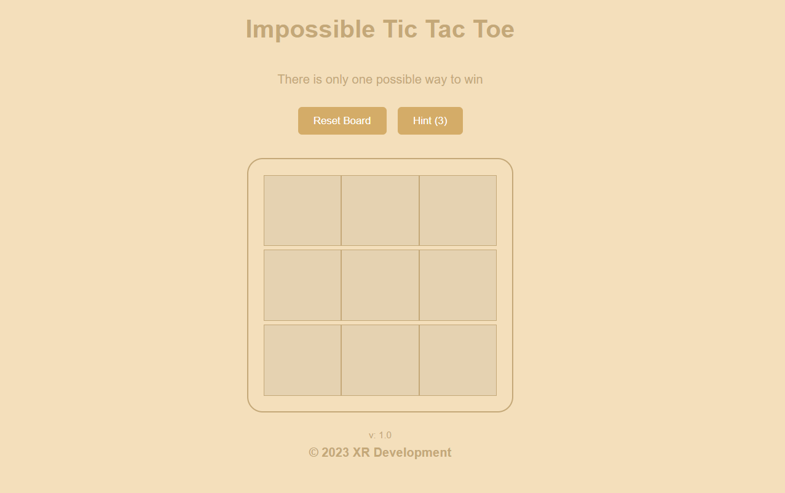
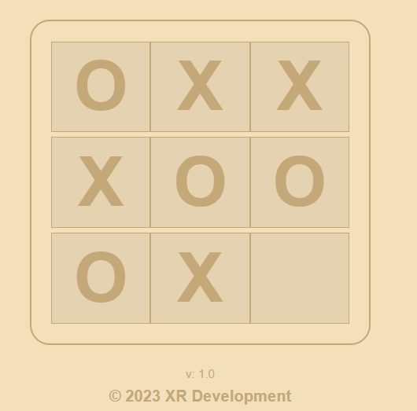
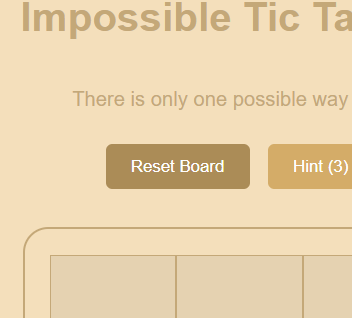
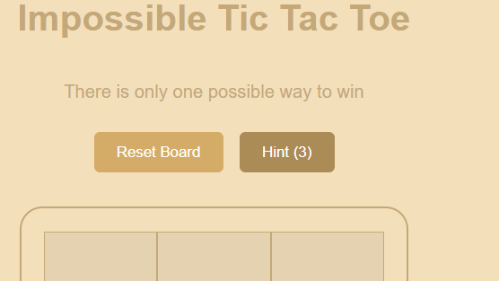

# Impossible Tic Tac Toe
)
)

## Overview

Impossible Tic Tac Toe is an advanced version of the classic Tic Tac Toe game. It includes a highly intelligent AI opponent that is nearly impossible to defeat. Can you beat the unbeatable?

## Features

- **Challenging AI:** The computer player employs advanced strategies to maximize its chances of winning. It's not easy to outsmart becuase its really dumb!

- **Limited Hints:** You have three hints available during the game. Use them wisely to get an advantage over the computer.

- **Responsive Design:** Play the game on various devices, as it's designed to work seamlessly on both desktop and mobile.

## How to Play

1. Open the game in your browser.
2. Click on a cell to make your move (you are "O").
4. The computer (playing as "X") will make its move.
5. Continue taking turns until the game ends.
6. If you win, the status box will display "You have won the game!" If the computer wins, it will say "The computer has won...". In case of a draw, it will show "It's a draw! Nobody has won the game."

# Button Useage

## Reset Board Button
Pressing this button will reset the board that icludes your game so don't click it on accedient!

## Hint Button
Pressing this button will give you a hint but please know that it is defintly not always useful it can even make you lose sometimes be careful when using this.

# Coming Soon
## v: 1.1
1. Controller Support - **Xbox** Only at this point.
2. Chnage log - This will show when the game has been updated it will only show once as it will be stored using [Local Browser Storage](https://en.wikipedia.org/wiki/Web_storage).
3. Improved AI - This will imporve the **Computer / AI** for the game this also makes the **Hint System** better as well.
4. Other GUI Fixes
## v: 1.2
***Nothing Planed Yet!***

# Getting Started

## Play Online
1. Go to `https://xrdevelopment.net/plus-games/81023`
2. Have Fun!

## Play Localy
1. Clone this repository to your computer by using this command `git clone https://github.com/RebeccaSkittles/Impossible-Tic-Tac-Toe/repo.git` or download it from github
2. Open `index.html` in your web browser to start the game.
3. Have Fun!
   
# Technologies Used

- HTML
- CSS
- JavaScript

# License

This project is licensed under the [MIT License](lisence.txt)
